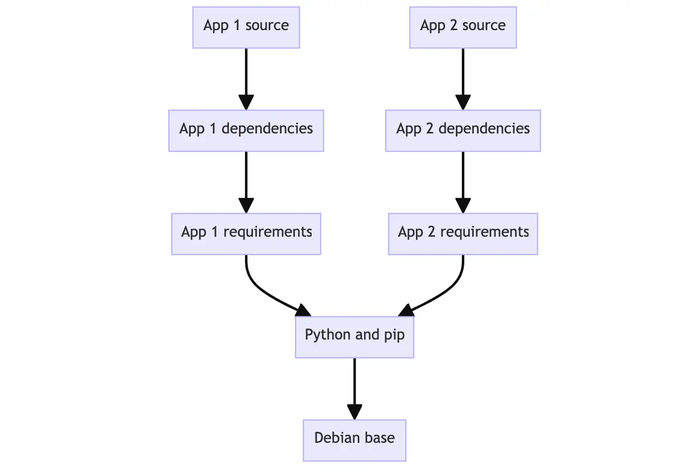

Se trata de uma ferramenta de containerização de aplicações

Com Docker podemos fazer deploy de Containers que poderão ser executados em diversos lugares sem a necessidade de se adequar a especificações de cada máquina
# Arquitetura
# Imagens
São a planta baixa da definição de como o Container deve operar

Definimos uma imagem de acordo com as especificações que desejamos num arquivo denominado Dockerfile

Podemos criar um Container a partir de uma imagem ao executar `docker build .`

Podemos importar um imagem já existente num registry e executá-la, gerando o Container, usando `docker run`

A customização de imagens é comum pois, frequentemente gostaríamos de adicionar arquivos e/ou funcionalidades ao Container já em sua criação, como por exemplo instalação de um pacote Go

**Imagens são imutáveis**
## Layers
A estrutura de um Dockerfile é construída em camadas (layers) onde **cada layer é uma instrução a ser realizada na criação do Container**


**Podemos reutilizar layers ja existentes em outras imagens**, tornando o desenvolvimento mais ágil.


## Dockerfile
Se trata do documento que define as instruções (Layers) que serão usadas para a criação de uma Imagem. Para tal podemos fazer uso dos seguintes comandos:
### FROM
Define a imagem base a ser usada, bem como sua versão e tags
### WORKDIR
Define o diretório onde as subseguintes Layers irão operar
### COPY
Realiza a cópia de dados de uma fonte para um destino sendo o destino a localização no Container
### ADD
### RUN
Realiza a execução de um dado comando durante o processo de build da imagem
### ENV
Permite setar variaveis de ambiente a serem usadas pelo Container
### ARG
Permite definir variáveis, invisíveis ao Container, mas úteis no desenvolvimento pois torna o código mais DRY
### CMD
Determina o comando padrão a ser executado quando um Container estiver sob execução
### ENTRYPOINT
### USER
Define um perfil de usuário que irá executar as subseguintes etapas
### EXPOSE
Define a porta que o Container deve expor para se comunicar
## Cache
Docker se beneficia de cache de builds anteriores mitigando a necessidade de executar novamente o mesmo comando durante o novo build, tornando mais eficiente este processo

O Docker não irá fazer uso do cache em situações como:
1. Alterações de uma Layer RUN
2. Alterações em arquivos em COPY/ADD

**No momento que uma Layer tem seu cache invalidado, as subseguintes também o terão**
## Multi-stage builds
Possibilita a execução concorrente de etapas em diferentes ambientes tornando o build mais eficiente e, ao fim de cada uma dessas etapas, podemos selecionar somente o que nos é pertinente para a execução do Container, tornando-o mais leve e diminuindo a superfície de ataques.

Exemplo de aplicação Python:
```docker
# ── Stage 1: Builder ──────────────────────────────────────────
FROM python:3.12-slim AS builder

WORKDIR /app

# Install build dependencies
RUN pip install --upgrade pip
COPY requirements.txt .
RUN pip install --no-cache-dir --prefix=/install -r requirements.txt

# ── Stage 2: Runtime ──────────────────────────────────────────
FROM python:3.12-slim AS runtime

WORKDIR /app

# Copy only installed packages from builder
COPY --from=builder /install /usr/local

# Copy application source
COPY src/ .

ENV PYTHONDONTWRITEBYTECODE=1 \
    PYTHONUNBUFFERED=1

EXPOSE 8000
CMD ["python", "main.py"]
```

Exemplo de aplicação Go:
```docker
# ── Stage 1: Builder ──────────────────────────────────────────
FROM golang:1.22-alpine AS builder

WORKDIR /app

# Cache dependencies
COPY go.mod go.sum ./
RUN go mod download

# Build a statically linked binary
COPY . .
RUN CGO_ENABLED=0 GOOS=linux go build -ldflags="-s -w" -o server ./cmd/server

# ── Stage 2: Runtime ──────────────────────────────────────────
FROM scratch AS runtime

# Optional: add CA certs if making HTTPS calls
COPY --from=builder /etc/ssl/certs/ca-certificates.crt /etc/ssl/certs/

# Copy only the binary
COPY --from=builder /app/server /server

EXPOSE 8080
ENTRYPOINT ["/server"]
```
# Containers
Se tratam de processos isolados que desejamos operar e que são definidos por uma Imagem que **não necessitam de um kernel, hardware, programas e aplicações do host pois possuem suas proprias**

Algumas características de Containers são:

* Cada Container tem tudo que precisa para desempenhar sua função

* São isolados de hosts e outros Containers, garantindo segurança

* Cada Container é gerenciado de forma independente

* Garantem reprodutibilidade 
# Volumes
São formas persistentes de armazenamento de dados de Containers dentro do Docker
# Bind
São formas persistentes de armazenamento de dados de Containers no Host, isto é, na maquina em que está sendo executado o Container
# Namespaces
# overlayfs
# CLI
## docker build
## docker run
## docker start
## docker stop
## docker Container prune
## docker Container attach
## docker Container stats
## docker Container kill
## docker Container logs
## docker Container checkpoint
## docker Container restore
## docker Container commit
## docker Container mount
## docker Container unmount
## docker Container update
## docker Container exec
## docker Container top
## docker Container export
## docker Container port
## docker image prune
## docker volume create
## docker volume mount
## docker volume prune
## docker volume delete
## docker volume exists
